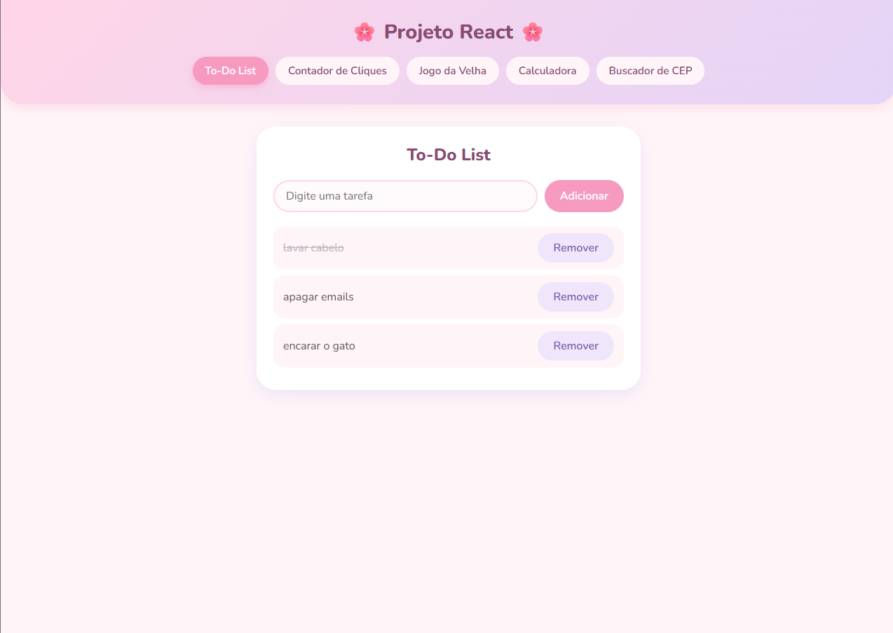
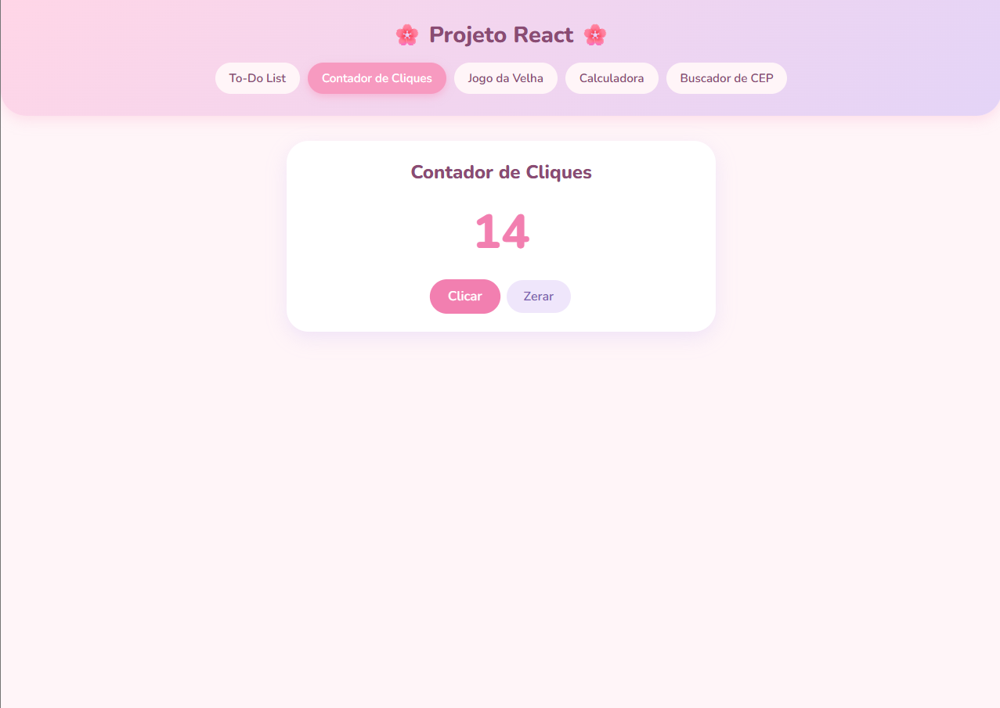
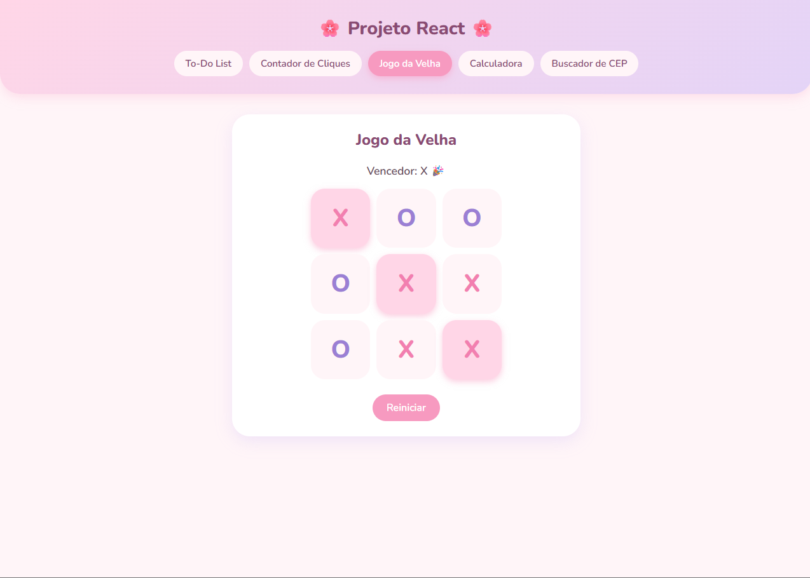
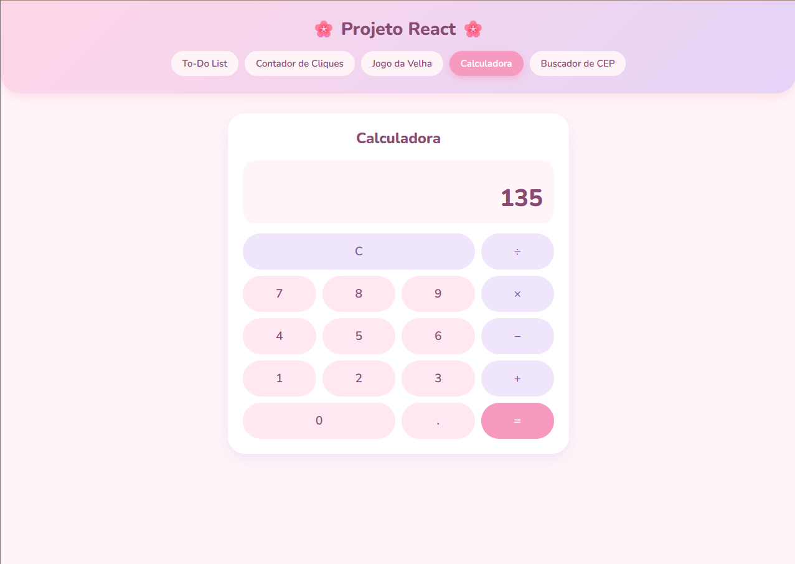
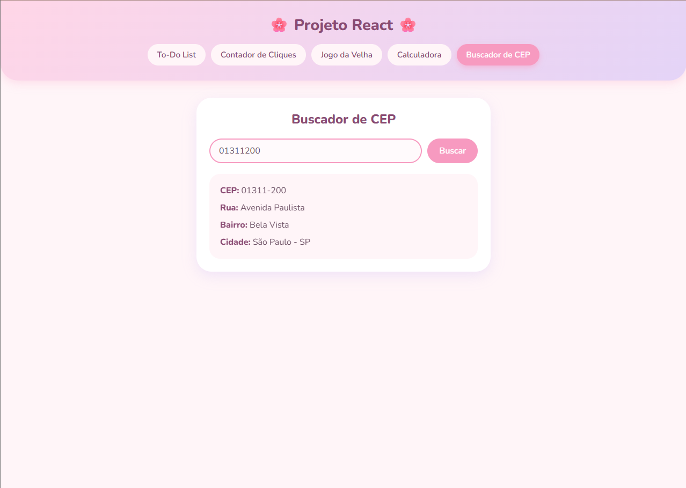

# Projeto React

Projeto da disciplina de Programação Web: uma aplicação React com cinco funcionalidades, versionada com Git e publicada na Vercel.

## Links

- Repositório: https://github.com/oIsabelaM/ProjetoReact
- Site online: https://meu-projeto-react-tau.vercel.app/

## Funcionalidades

| Funcionalidade | O que faz | Conceitos usados |
|---|---|---|
| To-Do List | Adiciona, marca como feita e remove tarefas | `useState`, formulário, `map`, `filter` |
| Contador de Cliques | Soma cliques e zera o contador | `useState`, `onClick` |
| Jogo da Velha | Jogo para dois jogadores, com vencedor e empate | `useState`, lista de 9 posições |
| Calculadora | Soma, subtração, multiplicação e divisão | `useState`, lógica de operações |
| Buscador de CEP | Consulta endereço pela API ViaCEP | `fetch`, `async/await`, `try/catch` |

## Estrutura

- `src/App.js`: controla qual funcionalidade aparece na tela.
- `src/App.css`: estilo de todo o projeto.
- `src/components/Header.js`: cabeçalho com os cinco botões.
- `src/components/`: um arquivo por funcionalidade.

## Estilização

- CSS puro em um único arquivo (`App.css`), sem biblioteca extra.
- Paleta pastel de rosa e lilás, para um visual leve e acolhedor.
- Fonte Nunito (Google Fonts), arredondada.
- Cantos arredondados, sombras suaves e efeito ao passar o mouse nos botões.

## Tecnologias

React (Create React App), JavaScript, CSS, API ViaCEP, Git, GitHub e Vercel.

## Como executar

1. Clone o repositório.
2. Instale as dependências com `npm install`.
3. Inicie com `npm start`.
4. Acesse `http://localhost:3000`.

## Etapas realizadas

1. Instalação do Node.js e criação do projeto com `npx create-react-app`.
2. Criação do cabeçalho e da navegação entre as telas.
3. Desenvolvimento das cinco funcionalidades, uma por vez.
4. Aplicação do estilo pastel.
5. Versionamento com Git: um commit e uma tag a cada funcionalidade.
6. Envio ao GitHub.
7. Deploy na Vercel, conectado ao repositório.

## Versões (tags)

| Tag | Conteúdo |
|---|---|
| v0.1.0 | Cabeçalho e Contador de Cliques |
| v0.2.0 | To-Do List |
| v0.2.1 | Novo estilo visual |
| v0.3.0 | Calculadora |
| v0.4.0 | Jogo da Velha |
| v0.5.0 | Buscador de CEP |
| v1.0.0 | Versão final com deploy e documentação |

## Prints das telas

### To-Do List

### Contador de Cliques

### Jogo da Velha

### Calculadora

### Buscador de CEP
